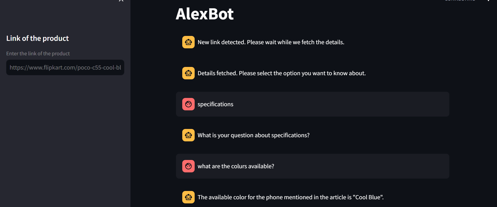

# AlexBot


## Installation
To install the required packages, run the following command in the terminal:

```bash
pip install -r requirements.txt
```

## Run the bot
To run the bot, run the following command in the terminal:

```bash
streamlit run trial.py
```

## Usage
Enter the OpenAI key in model.py
The bot will ask you to enter a link to a Flipkart product. After entering the link, the bot will also ask you to enter a question. After entering the question, the bot will answer the question based on the product details.

## Technologies Used
- Python
- Streamlit
- OpenAI
- BeautifulSoup4

## Demo

